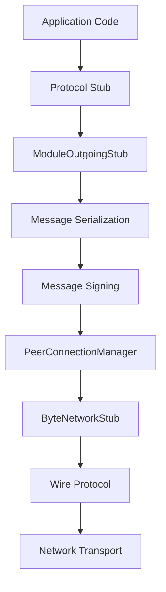
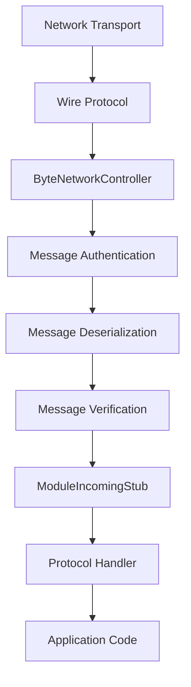
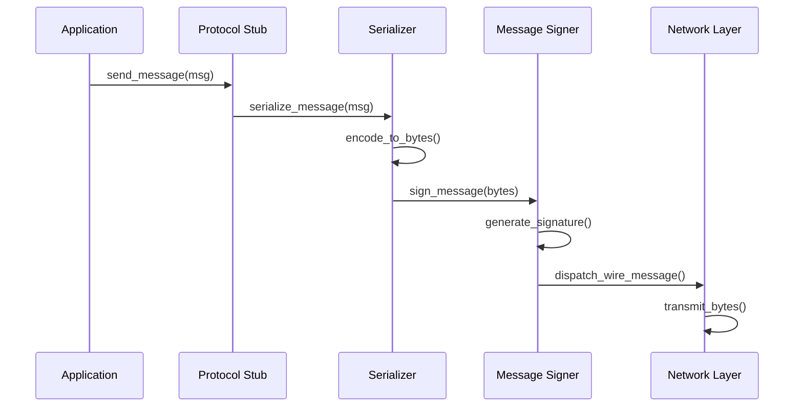

# Atlas-Communication

<div align="center">
  <h1>🌐 Atlas Communication Layer</h1>
  <p><em>A robust, modular network communication infrastructure enabling secure, reliable message passing between nodes in distributed systems</em></p>

  [](https://www.rust-lang.org/)
  [](https://opensource.org/licenses/MIT)
</div>

---

## 📋 Table of Contents

- [Overview](#-overview)
- [Architecture](#-architecture)
- [Core Components](#-core-components)
- [Message Flow](#-message-flow)
- [Serialization System](#-serialization-system)
- [Getting Started](#-getting-started)
- [Configuration](#-configuration)
- [Examples](#-examples)
- [Contributing](#-contributing)

---

## 🌟 Overview

Atlas-Communication provides the fundamental network communication infrastructure for the Atlas distributed consensus framework. It offers a **layered, abstracted approach** to network operations, supporting distributed consensus protocols with various messaging patterns and connection management capabilities.

### Key Features

- 🔒 **Secure Communication**: Built-in message authentication and verification
- 🔄 **Protocol Agnostic**: Pluggable serialization backends (Serde, Cap'n Proto)
- 🚀 **High Performance**: Zero-copy message handling and efficient connection pooling
- 🔧 **Modular Design**: Clean separation between network layers and protocol logic
- 📊 **Metrics Integration**: Built-in performance monitoring and diagnostics
- 🔌 **Pluggable Backends**: Support for different underlying network implementations

---

## 🏗️ Architecture

The communication layer is organized into **four distinct abstraction layers**, each with specific responsibilities:

```
┌─────────────────────────────────────────────────────────────────┐
│                    🎯 Application Layer                         │
│  ┌─────────────────┐ ┌─────────────────┐ ┌─────────────────┐   │
│  │ OperationStub   │ │ StateProtocol   │ │ ApplicationStub │   │
│  │                 │ │ Stub            │ │                 │   │
│  └─────────────────┘ └─────────────────┘ └─────────────────┘   │
│  ┌─────────────────┐                                           │
│  │ReconfigurationStub│                                         │
│  └─────────────────┘                                           │
├─────────────────────────────────────────────────────────────────┤
│                    📦 Message Layer                             │
│  ┌─────────────────┐ ┌─────────────────┐ ┌─────────────────┐   │
│  │ ModuleIncoming  │ │ ModuleOutgoing  │ │ Message         │   │
│  │ Stub            │ │ Stub            │ │ Verification    │   │
│  └─────────────────┘ └─────────────────┘ └─────────────────┘   │
├─────────────────────────────────────────────────────────────────┤
│                    🔗 Connection Layer                          │
│  ┌─────────────────┐ ┌─────────────────┐ ┌─────────────────┐   │
│  │PeerConnection   │ │ NetworkNode     │ │ LookupTable     │   │
│  │ Manager         │ │                 │ │                 │   │
│  └─────────────────┘ └─────────────────┘ └─────────────────┘   │
├─────────────────────────────────────────────────────────────────┤
│                    ⚡ Byte Network Layer                        │
│  ┌─────────────────┐ ┌─────────────────┐ ┌─────────────────┐   │
│  │ByteNetwork      │ │ ByteNetwork     │ │ Wire Protocol   │   │
│  │ Controller      │ │ Stub            │ │                 │   │
│  └─────────────────┘ └─────────────────┘ └─────────────────┘   │
└─────────────────────────────────────────────────────────────────┘
```

### Layer Responsibilities

#### 🎯 **Application Layer** (High-Level Stubs)
- **Purpose**: Protocol-specific message handling
- **Components**: `OperationStub`, `ReconfigurationStub`, `StateProtocolStub`, `ApplicationStub`
- **Responsibilities**: 
  - Protocol-specific message routing
  - High-level API for different Atlas protocols
  - Message type safety and validation

#### 📦 **Message Layer** (Module-Level Processing)
- **Purpose**: Message serialization, verification, and routing
- **Components**: `ModuleIncomingStub`, `ModuleOutgoingStub`, Message verification
- **Responsibilities**:
  - Message serialization/deserialization
  - Digital signature verification
  - Message routing to appropriate handlers
  - Protocol-agnostic message processing

#### 🔗 **Connection Layer** (Peer Management)
- **Purpose**: Peer connection management and message dispatch
- **Components**: `PeerConnectionManager`, `NetworkNode`, `LookupTable`
- **Responsibilities**:
  - Peer discovery and connection establishment
  - Connection lifecycle management
  - Message dispatch to appropriate peers
  - Network topology awareness

#### ⚡ **Byte Network Layer** (Transport)
- **Purpose**: Low-level network operations and transport
- **Components**: `ByteNetworkController`, `ByteNetworkStub`, Wire protocol
- **Responsibilities**:
  - Raw byte transmission/reception
  - Transport protocol implementation
  - Connection pooling and management
  - Network I/O operations

---

## 🔧 Core Components

### NetworkManagement

The **central coordination structure** that integrates all network components:

```rust
pub struct NetworkManagement<NI, CN, BN, R, O, S, A>
where
    R: Serializable + 'static,    // Reconfiguration messages
    O: Serializable + 'static,    // Operation messages  
    S: Serializable + 'static,    // State protocol messages
    A: Serializable + 'static,    // Application messages
    BN: Clone,                     // Byte network controller
    CN: Clone,                     // Connection stub
{
    id: NodeId,                           // Node identifier
    network_info: Arc<NI>,                // Network topology info
    rng: Arc<ThreadSafePrng>,            // Cryptographic RNG
    conn_manager: NodeStubController<..>, // Connection manager
    byte_network_controller: BN,          // Byte-level controller
}
```

### Message Types and Modules

The system supports **four distinct message modules**:

```rust
#[derive(Clone, Debug, EnumIter, Enum)]
pub enum MessageModule {
    Reconfiguration,  // Network reconfiguration messages
    Protocol,         // Consensus protocol messages
    StateProtocol,    // State transfer messages
    Application,      // Application-specific messages
}
```

### Serializable Trait

All message types must implement the `Serializable` trait:

```rust
pub trait Serializable: Send {
    type Message: SerMsg;
    type Verifier: InternalMessageVerifier<Self::Message>;
}
```

---

## 🔄 Message Flow

### Outgoing Message Path



### Incoming Message Path



### Message Processing Pipeline

1. **🔐 Authentication**: Verify message signature and sender identity
2. **📝 Deserialization**: Convert bytes to structured message objects
3. **✅ Verification**: Validate message contents and internal consistency
4. **🎯 Routing**: Direct message to appropriate protocol handler
5. **⚡ Processing**: Execute protocol-specific message handling logic

---

## 🔒 Serialization System

Atlas-Communication supports **multiple serialization backends** through feature flags:

### Supported Backends

#### 🦀 **Serde (Default)**
```toml
[features]
serialize_serde = ["serde", "bincode", "serde_bytes", "atlas-common/serialize_serde"]
default = ["serialize_serde"]
```

- **Format**: Binary (via bincode)
- **Performance**: High
- **Features**: Rust-native, type-safe, zero-copy deserialization
- **Use Case**: General purpose, high-performance scenarios

#### ⚡ **Cap'n Proto**
```toml
[features]
serialize_capnp = ["atlas-capnp", "capnp"]
```

- **Format**: Cap'n Proto binary format
- **Performance**: Ultra-high (infinite speed)
- **Features**: Zero-copy, cross-language compatibility
- **Use Case**: Maximum performance, language interoperability

### Serialization Process



### Wire Message Format

Every message sent over the network follows this structure:

```
┌─────────────────────────────────────────────────────────────┐
│                        Header (Fixed Size)                  │
├─────────────────────────────────────────────────────────────┤
│ Version │  From  │   To   │     Nonce     │    Length      │
│ (4 bytes)│(4 bytes)│(4 bytes)│  (8 bytes)   │  (8 bytes)    │
├─────────────────────────────────────────────────────────────┤
│                    Digest (32 bytes)                        │
├─────────────────────────────────────────────────────────────┤
│                   Signature (64 bytes)                      │
├─────────────────────────────────────────────────────────────┤
│                   Payload (Variable Size)                   │
│              [Serialized Message Content]                   │
└─────────────────────────────────────────────────────────────┘
```

### Message Header Structure

```rust
#[repr(C, packed)]
pub struct Header {
    _align: u32,                              // Memory alignment
    version: u32,                             // Protocol version
    from: u32,                                // Sender node ID
    to: u32,                                  // Recipient node ID  
    nonce: u64,                               // Random nonce
    length: u64,                              // Payload length
    digest: [u8; 32],                         // SHA-256 hash
    signature: [u8; 64],                      // Ed25519 signature
}
```

---

## 🚀 Getting Started

### Prerequisites

- **Rust 2021 Edition** or later
- **Atlas Framework** dependencies

### Installation

Add to your `Cargo.toml`:

```toml
[dependencies]
atlas-communication = { path = "../Atlas-Communication" }

# Choose serialization backend
atlas-communication = { path = "../Atlas-Communication", features = ["serialize_serde"] }
# OR
atlas-communication = { path = "../Atlas-Communication", features = ["serialize_capnp"] }
```

### Basic Usage

```rust
use atlas_communication::{NetworkManagement, stub::*};
use atlas_communication::serialization::Serializable;

// Define your message types
#[derive(Serialize, Deserialize)]
struct MyProtocolMessage {
    // Your protocol fields
}

impl Serializable for MyProtocol {
    type Message = MyProtocolMessage;
    type Verifier = MyMessageVerifier;
}

// Initialize the network management
let network_mgmt = NetworkManagement::initialize(
    network_info,
    config,
    reconfiguration_channel
)?;

// Create protocol-specific stubs
let operation_stub = network_mgmt.init_op_stub();
let app_stub = network_mgmt.init_app_stub();

// Send messages
operation_stub.send(message, target_node, flush: true)?;
app_stub.broadcast(message, target_nodes)?;
```

---

## ⚙️ Configuration

### Client Pool Configuration

```rust
use atlas_communication::config::ClientPoolConfig;

let config = ClientPoolConfig::new(
    batch_limit: 1024,           // Max messages per batch
    per_client_bound: 1024,      // Buffer size per client
    clients_per_pool: 1024,      // Max clients per pool
    batch_timeout_micros: 500,   // Batch timeout (μs)
    batch_sleep_micros: 250,     // Sleep between batches (μs)
    channel_size: 1024,          // Channel buffer size
);
```

### Network Information Provider

Implement the `NetworkInformationProvider` trait for your topology:

```rust
trait NetworkInformationProvider {
    fn own_node_info(&self) -> NodeInfo;
    fn get_node_info(&self, node_id: NodeId) -> Option<NodeInfo>;
    // ... other methods
}
```[Cargo.toml](../Atlas-Comm-MIO/Cargo.toml)
[Cargo.toml](../Atlas-Comm-MIO/Cargo.toml)
---

## 📊 Performance Characteristics

- **Zero-copy deserialization** where possible
- **Connection pooling** reduces allocation overhead
- **Configurable buffer sizes** for memory tuning
- **Per Module hot path** to prevent central contention

---

## 🔍 Examples

### Simple Echo Server

```rust
// Create network management
let network = NetworkManagement::initialize(network_info, config, reconf_channel)?;

// Get application stub for handling app messages
let app_stub = network.init_app_stub();

// Handle incoming messages
while let Ok(message) = app_stub.receive().await {
    let response = process_message(message.message());
    app_stub.send(response, message.header().from(), true)?;
}
```

### Broadcast Protocol

```rust
let operation_stub = network.init_op_stub();

// Broadcast to all known nodes
let all_nodes = network_info.get_all_node_ids();
operation_stub.broadcast_signed(protocol_message, all_nodes.iter())?;
```

---

## 🤝 Contributing

We welcome contributions! Please see our [Contributing Guidelines](CONTRIBUTING.md) for details.

### Development Setup

```bash
# Clone the repository
git clone https://github.com/nuno1212s/atlas.git
cd Atlas/Atlas-Communication

# Run tests
cargo test

# Run with different features
cargo test --features serialize_capnp
cargo test --features serialize_serde
```

### Architecture Guidelines

- **Maintain layer separation**: Keep abstractions clean and well-defined
- **Performance first**: Optimize for zero-copy and minimal allocations
- **Type safety**: Leverage Rust's type system for correctness
- **Modularity**: Design for pluggable components and backends

---

## 📄 License

This project is licensed under the MIT License - see the [LICENSE](LICENSE.txt) file for details.

---

## 🙏 Acknowledgments

- Built as part of the **Atlas Distributed Consensus Framework**
- Inspired by modern distributed systems research
- Special thanks to the Rust community for excellent async/networking libraries

---

<div align="center">
  <p><em>Built with ❤️ by the Atlas Team</em></p>
  <p>
    <a href="https://github.com/nuno1212s/atlas">🏠 Atlas Framework</a> •
    <a href="https://docs.rs/atlas-communication">📚 Documentation</a> •
    <a href="https://github.com/nuno1212s/atlas/issues">🐛 Report Bug</a>
  </p>
</div>
